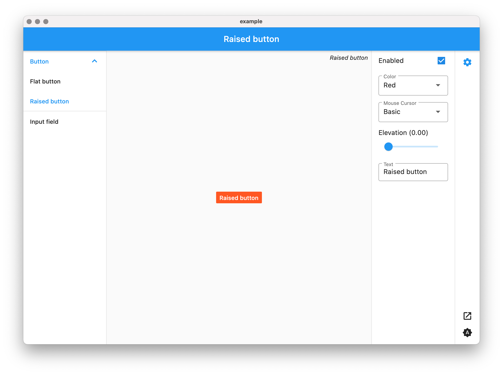

# storybook_flutter

Create a simple storybook to showcase widgets.



## Getting Started

```dart
class MyApp extends StatelessWidget {
  @override
  Widget build(BuildContext context) => Storybook(
    children: [
      Story(
        name: 'Flat button',
        child: MaterialButton(child: Text('Flat button'), onPressed: () {}),
      ),
      Story(
        name: 'Raised button',
        child: RaisedButton(child: Text('Raised button'), onPressed: () {}),
      ),
      Story(
        name: 'Input field',
        child: TextField(
          decoration: InputDecoration(
            border: OutlineInputBorder(),
            labelText: 'Input field',
          ),
        ),
      ),
    ],
  );
}
```

## Features and bugs

Please file feature requests and bugs at the [issue tracker][tracker].

[tracker]: https://github.com/ookami-kb/storybook_flutter/issues
